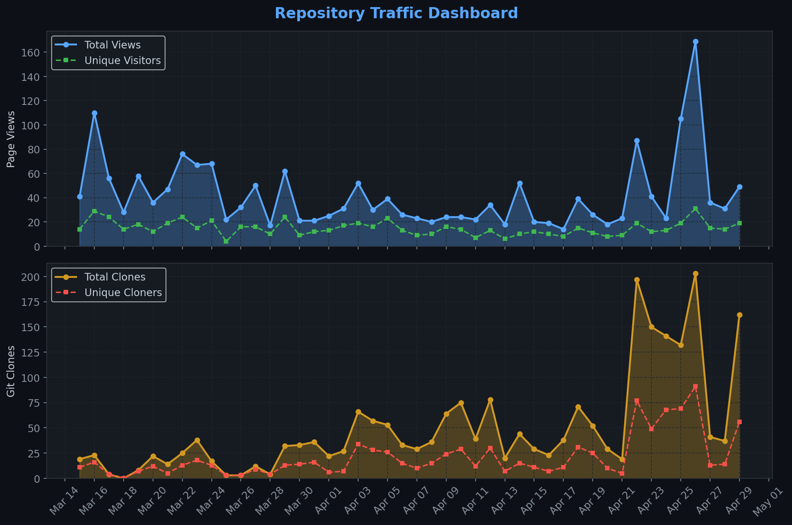
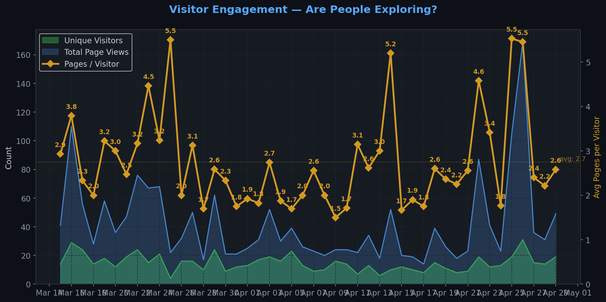
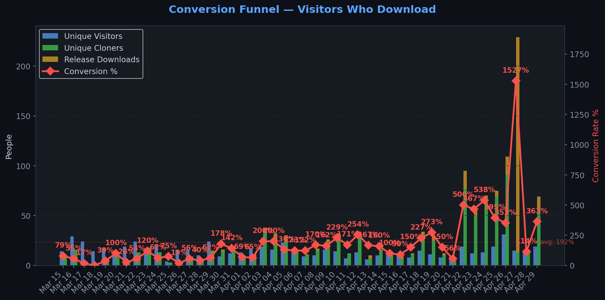
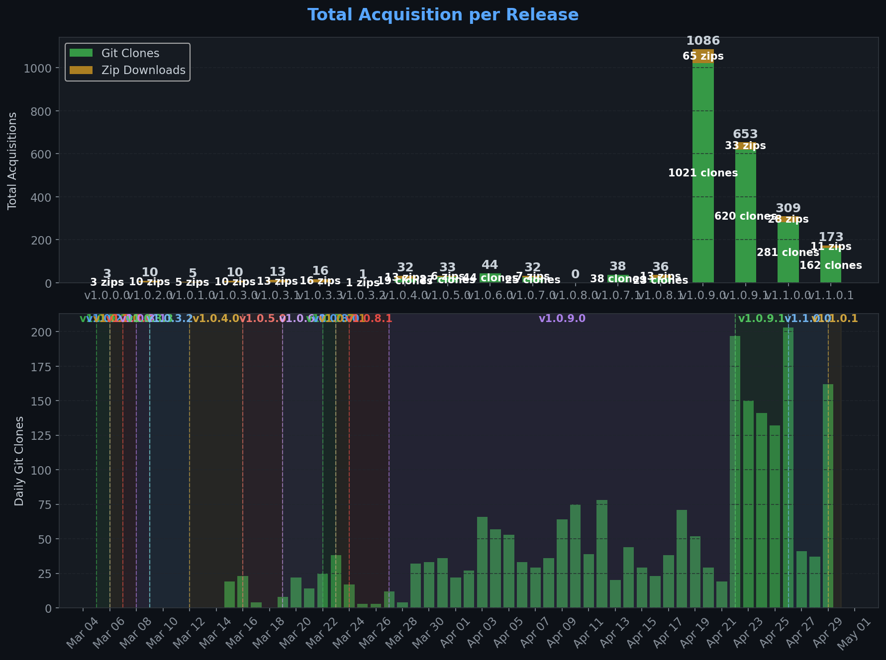
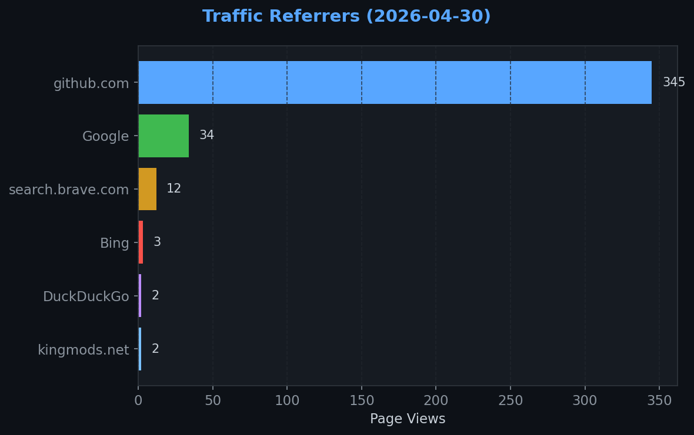
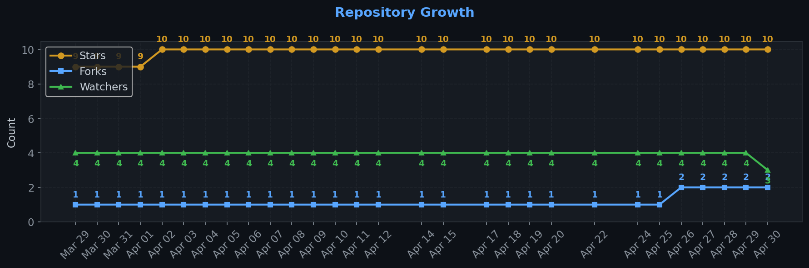

# Repository Traffic Dashboard

**Last updated:** 2026-04-30T06:23:46Z
**Days tracked:** 29 | **Download snapshots:** 139 (hourly)

---

## Views & Clones (14-day window, preserved forever)

| Metric | 14-Day Total | Unique |
|--------|-------------|--------|
| Page Views | 680 | 92 |
| Git Clones | 1295 | 461 |

> **Engagement:** 7.3 pages per visitor (14-day avg)

---

## Visitor Engagement

> Higher = visitors exploring more pages. 1.0 = bounce. 3.0+ = deeply engaged.

---

## Conversion Funnel

> **14-day conversion:** 695 of 92 visitors cloned or downloaded (**755.4%**)
>
> Unique cloners: 461 | Release downloads: 234

---

## Total Acquisition per Release (Downloads + Clones)

| Channel | Count |
|---------|-------|
| Zip Downloads | 234 |
| Git Clones (14-day) | 1295 |
| **Total Acquisitions** | **1529** |

---

## Referrers

| Source | Views | Unique |
|--------|-------|--------|
| github.com | 345 | 62 |
| Google | 34 | 12 |
| search.brave.com | 12 | 1 |
| Bing | 3 | 2 |
| DuckDuckGo | 2 | 1 |
| kingmods.net | 2 | 1 |

---

## Repository Growth

| Metric | Current |
|--------|---------|
| Stars | 10 |
| Forks | 2 |
| Watchers | 3 |

---

## Top Pages (14-day)

| Page | Views | Unique |
|------|-------|--------|
| `/TheCodingDad-TisonK/FS25_SeasonalCropStress` | 338 | 81 |
| `/TheCodingDad-TisonK/FS25_SeasonalCropStress/issues` | 58 | 10 |
| `/TheCodingDad-TisonK/FS25_SeasonalCropStress/releases` | 31 | 15 |
| `/TheCodingDad-TisonK/FS25_SeasonalCropStress/releases/tag/v1.1.0.0` | 29 | 15 |
| `/TheCodingDad-TisonK/FS25_SeasonalCropStress/releases/tag/v1.0.9.1` | 28 | 21 |
| `/TheCodingDad-TisonK/FS25_SeasonalCropStress/releases/tag/v1.0.9.0` | 24 | 15 |
| `/TheCodingDad-TisonK/FS25_SeasonalCropStress/issues/69` | 24 | 8 |
| `/TheCodingDad-TisonK/FS25_SeasonalCropStress/pulls` | 23 | 4 |
| `/TheCodingDad-TisonK/FS25_SeasonalCropStress/issues/75` | 13 | 5 |
| `/TheCodingDad-TisonK/FS25_SeasonalCropStress/issues/76` | 11 | 4 |

---

## Data Files

| File | Description | Granularity |
|------|-------------|-------------|
| [daily.json](daily.json) | Views & clones per day (never expires) | Daily |
| [downloads.json](downloads.json) | Release download snapshots | Hourly |
| [referrers.json](referrers.json) | Referrer snapshots | Daily |
| [metadata.json](metadata.json) | Stars, forks, watchers | Daily |
| [stats.json](stats.json) | Combined legacy snapshots | 6-hourly |

---
*Hourly download tracking + full dashboard with engagement metrics every 6 hours*
*Auto-generated by [traffic-stats.yml](../../.github/workflows/traffic-stats.yml)*
