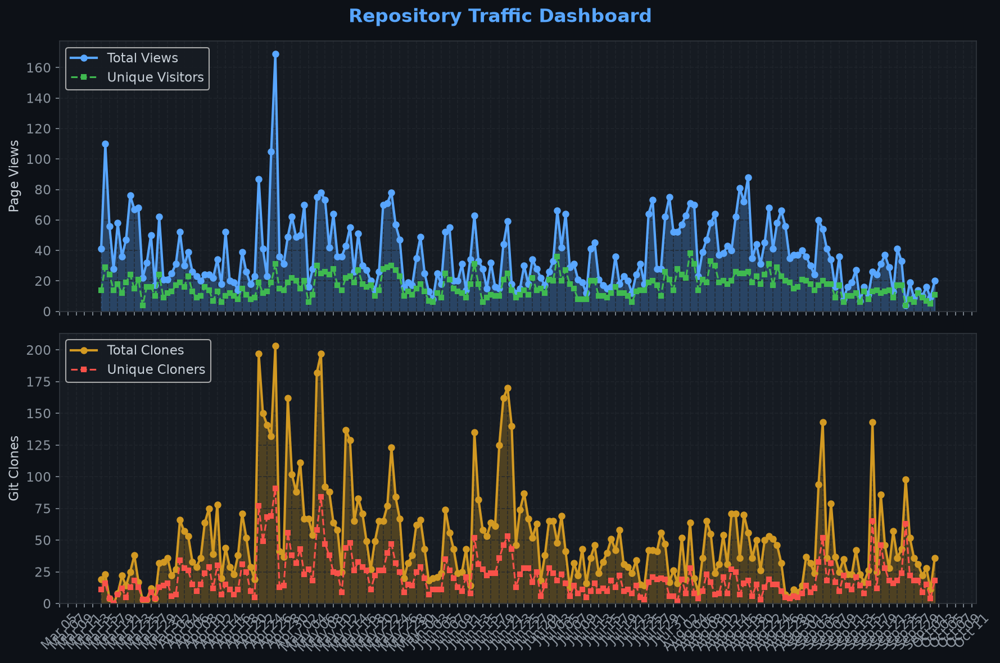
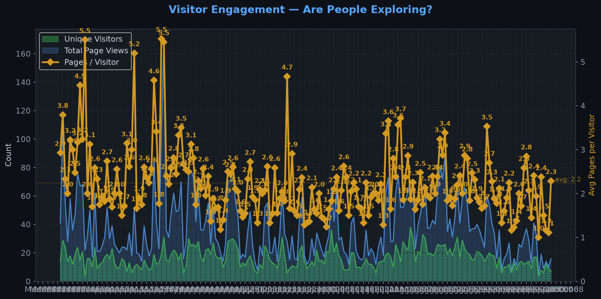
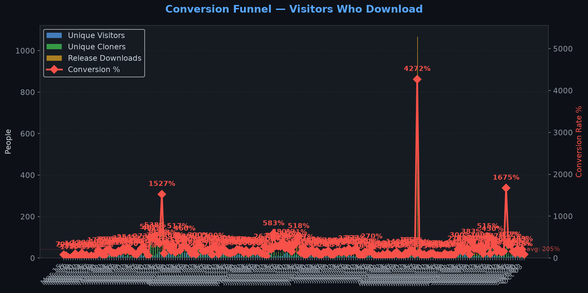
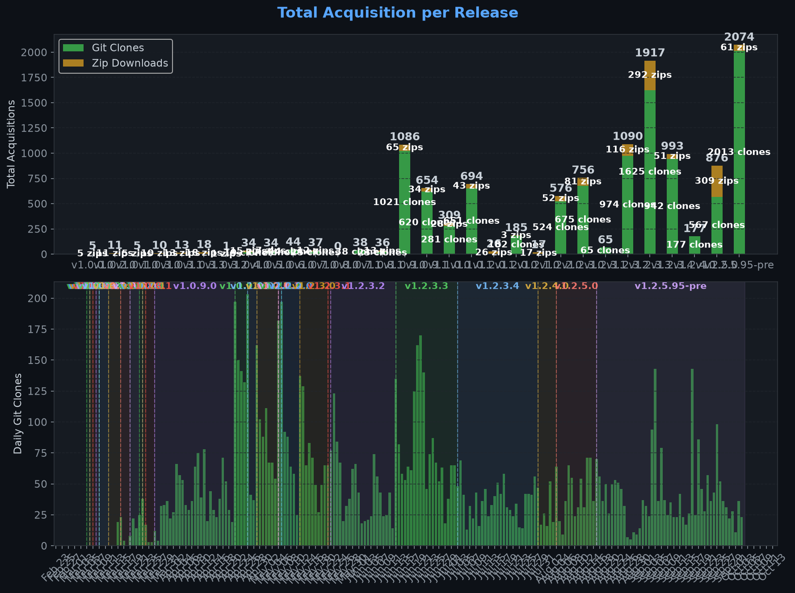
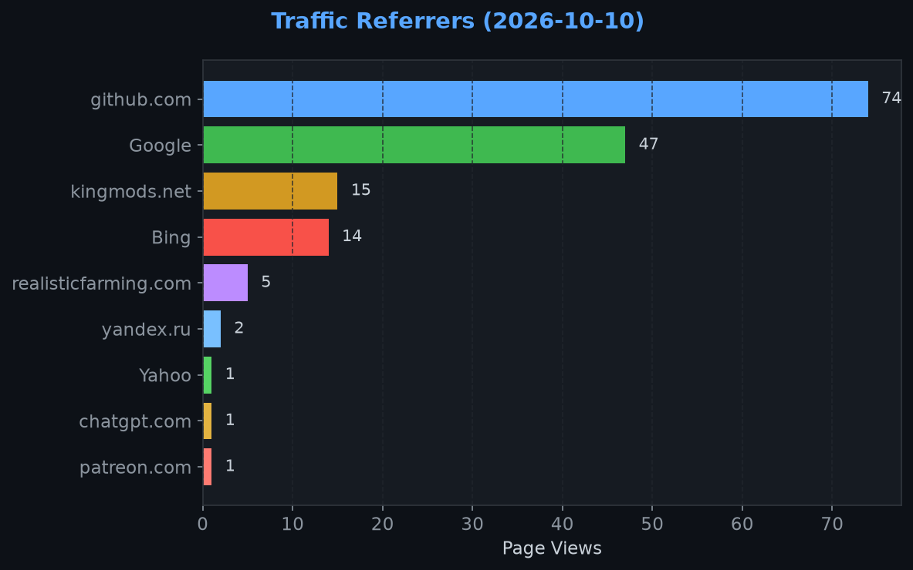
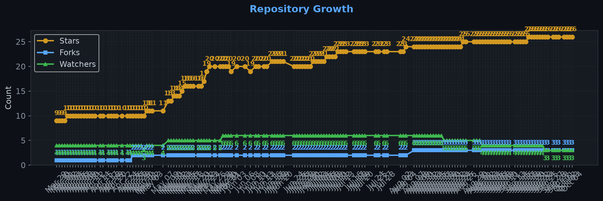

# Repository Traffic Dashboard

**Last updated:** 2026-10-10T00:25:27Z
**Days tracked:** 153 | **Download snapshots:** 915 (hourly)

---

## Views & Clones (14-day window, preserved forever)

| Metric | 14-Day Total | Unique |
|--------|-------------|--------|
| Page Views | 308 | 143 |
| Git Clones | 568 | 243 |

> **Engagement:** 2.1 pages per visitor (14-day avg)

---

## Visitor Engagement

> Higher = visitors exploring more pages. 1.0 = bounce. 3.0+ = deeply engaged.

---

## Conversion Funnel

> **14-day conversion:** 1554 of 143 visitors cloned or downloaded (**1086.7%**)
>
> Unique cloners: 243 | Release downloads: 1311

---

## Total Acquisition per Release (Downloads + Clones)

| Channel | Count |
|---------|-------|
| Zip Downloads | 1311 |
| Git Clones (14-day) | 568 |
| **Total Acquisitions** | **1879** |

---

## Referrers

| Source | Views | Unique |
|--------|-------|--------|
| github.com | 74 | 63 |
| Google | 47 | 36 |
| kingmods.net | 15 | 7 |
| Bing | 14 | 11 |
| realisticfarming.com | 5 | 2 |
| yandex.ru | 2 | 1 |
| Yahoo | 1 | 1 |
| chatgpt.com | 1 | 1 |
| patreon.com | 1 | 1 |

---

## Repository Growth

| Metric | Current |
|--------|---------|
| Stars | 26 |
| Forks | 3 |
| Watchers | 3 |

---

## Top Pages (14-day)

| Page | Views | Unique |
|------|-------|--------|
| `/Realistic-Farming/FS25_SeasonalCropStress` | 170 | 116 |
| `/Realistic-Farming/FS25_SeasonalCropStress/releases` | 54 | 33 |
| `/Realistic-Farming/FS25_SeasonalCropStress/releases/tag/v1.2.5.0` | 36 | 31 |
| `/Realistic-Farming/FS25_SeasonalCropStress/issues` | 8 | 5 |
| `/Realistic-Farming/FS25_SeasonalCropStress/blob/main/IRRIGATION-HELP-DIALOG-DESIGN-BRIEF.md` | 4 | 4 |
| `/Realistic-Farming/FS25_SeasonalCropStress/tree/development` | 4 | 3 |
| `/Realistic-Farming/FS25_SeasonalCropStress/tree/v1.2.5.0` | 4 | 1 |
| `/Realistic-Farming/FS25_SeasonalCropStress/tree/main` | 3 | 2 |
| `/Realistic-Farming/FS25_SeasonalCropStress/branches` | 2 | 2 |
| `/Realistic-Farming/FS25_SeasonalCropStress/issues/83` | 2 | 2 |

---

## Data Files

| File | Description | Granularity |
|------|-------------|-------------|
| [daily.json](daily.json) | Views & clones per day (never expires) | Daily |
| [downloads.json](downloads.json) | Release download snapshots | Hourly |
| [referrers.json](referrers.json) | Referrer snapshots | Daily |
| [metadata.json](metadata.json) | Stars, forks, watchers | Daily |
| [stats.json](stats.json) | Combined legacy snapshots | 6-hourly |

---
*Hourly download tracking + full dashboard with engagement metrics every 6 hours*
*Auto-generated by [traffic-stats.yml](../../.github/workflows/traffic-stats.yml)*
