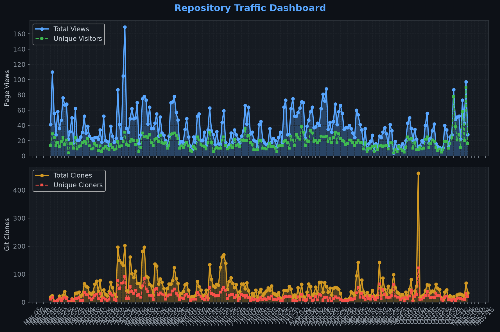
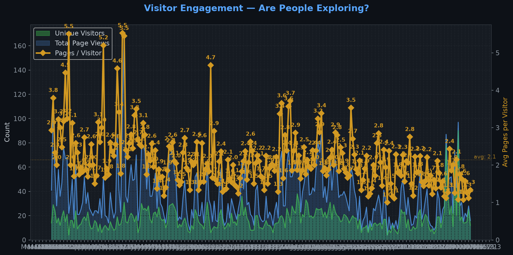
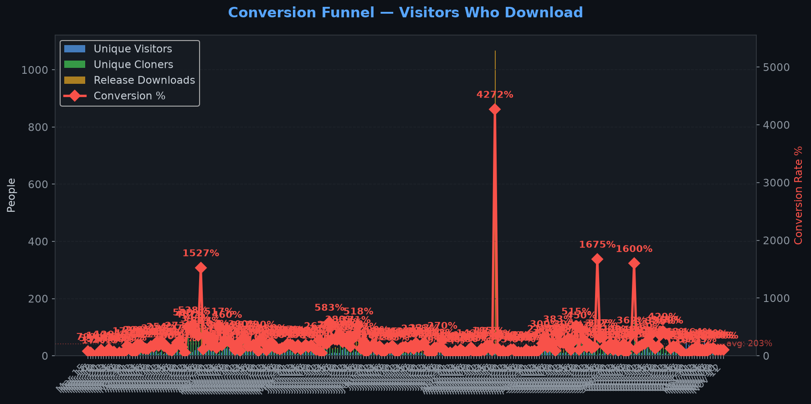
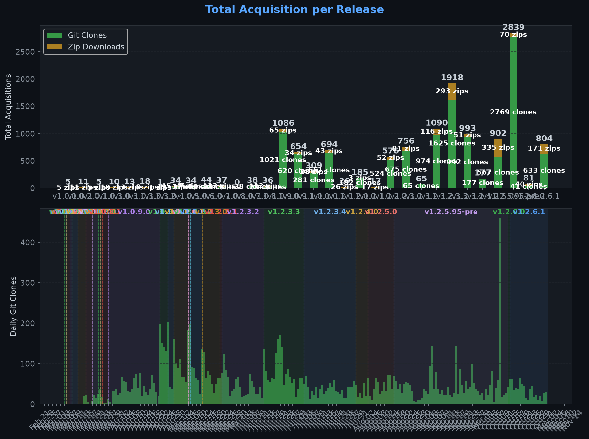
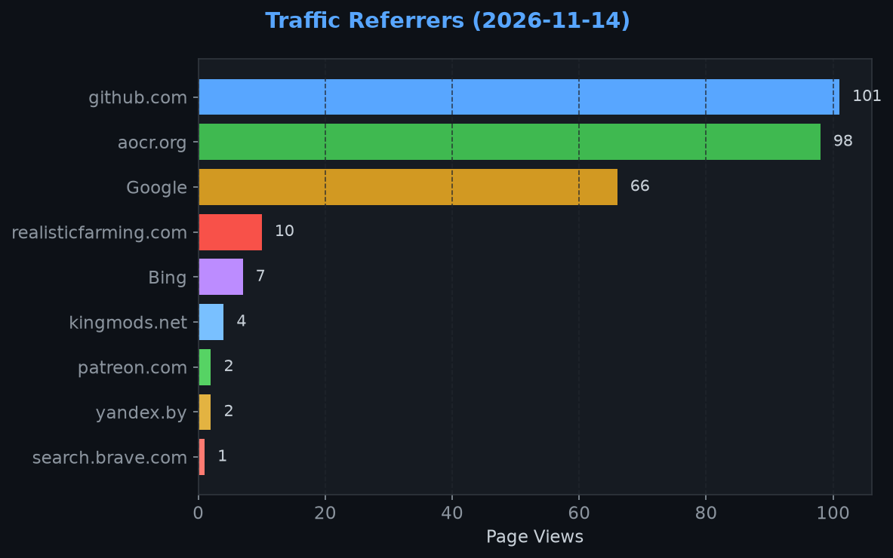
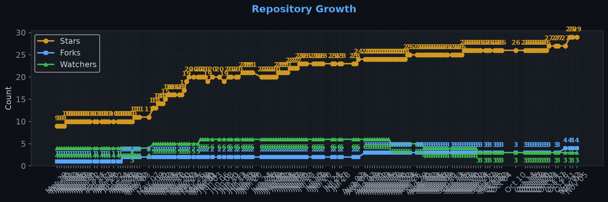

# Repository Traffic Dashboard

**Last updated:** 2026-11-05T18:26:50Z
**Days tracked:** 170 | **Download snapshots:** 1024 (hourly)

---

## Views & Clones (14-day window, preserved forever)

| Metric | 14-Day Total | Unique |
|--------|-------------|--------|
| Page Views | 536 | 313 |
| Git Clones | 311 | 121 |

> **Engagement:** 1.7 pages per visitor (14-day avg)

---

## Visitor Engagement

> Higher = visitors exploring more pages. 1.0 = bounce. 3.0+ = deeply engaged.

---

## Conversion Funnel

> **14-day conversion:** 1665 of 313 visitors cloned or downloaded (**531.9%**)
>
> Unique cloners: 121 | Release downloads: 1544

---

## Total Acquisition per Release (Downloads + Clones)

| Channel | Count |
|---------|-------|
| Zip Downloads | 1544 |
| Git Clones (14-day) | 311 |
| **Total Acquisitions** | **1855** |

---

## Referrers

| Source | Views | Unique |
|--------|-------|--------|
| github.com | 112 | 71 |
| aocr.org | 96 | 96 |
| Google | 66 | 35 |
| realisticfarming.com | 17 | 16 |
| Bing | 8 | 7 |
| DuckDuckGo | 3 | 1 |
| kingmods.net | 2 | 2 |
| Yahoo | 1 | 1 |
| forbidden-mods.de | 1 | 1 |
| patreon.com | 1 | 1 |

---

## Repository Growth

| Metric | Current |
|--------|---------|
| Stars | 29 |
| Forks | 4 |
| Watchers | 3 |

---

## Top Pages (14-day)

| Page | Views | Unique |
|------|-------|--------|
| `/Realistic-Farming/FS25_SeasonalCropStress` | 242 | 145 |
| `/Realistic-Farming/FS25_SeasonalCropStress/releases` | 65 | 49 |
| `/Realistic-Farming/FS25_SeasonalCropStress/releases/tag/v1.2.6.1` | 61 | 43 |
| `/Realistic-Farming/FS25_SeasonalCropStress/issues/92` | 10 | 10 |
| `/Realistic-Farming/FS25_SeasonalCropStress/issues` | 9 | 8 |
| `/Realistic-Farming/FS25_SeasonalCropStress/issues/83` | 5 | 5 |
| `/Realistic-Farming/FS25_SeasonalCropStress/pull/53` | 5 | 5 |
| `/Realistic-Farming/FS25_SeasonalCropStress/pull/55` | 5 | 5 |
| `/Realistic-Farming/FS25_SeasonalCropStress/issues/47` | 4 | 4 |
| `/Realistic-Farming/FS25_SeasonalCropStress/pull/73` | 4 | 4 |

---

## Data Files

| File | Description | Granularity |
|------|-------------|-------------|
| [daily.json](daily.json) | Views & clones per day (never expires) | Daily |
| [downloads.json](downloads.json) | Release download snapshots | Hourly |
| [referrers.json](referrers.json) | Referrer snapshots | Daily |
| [metadata.json](metadata.json) | Stars, forks, watchers | Daily |
| [stats.json](stats.json) | Combined legacy snapshots | 6-hourly |

---
*Hourly download tracking + full dashboard with engagement metrics every 6 hours*
*Auto-generated by [traffic-stats.yml](../../.github/workflows/traffic-stats.yml)*
