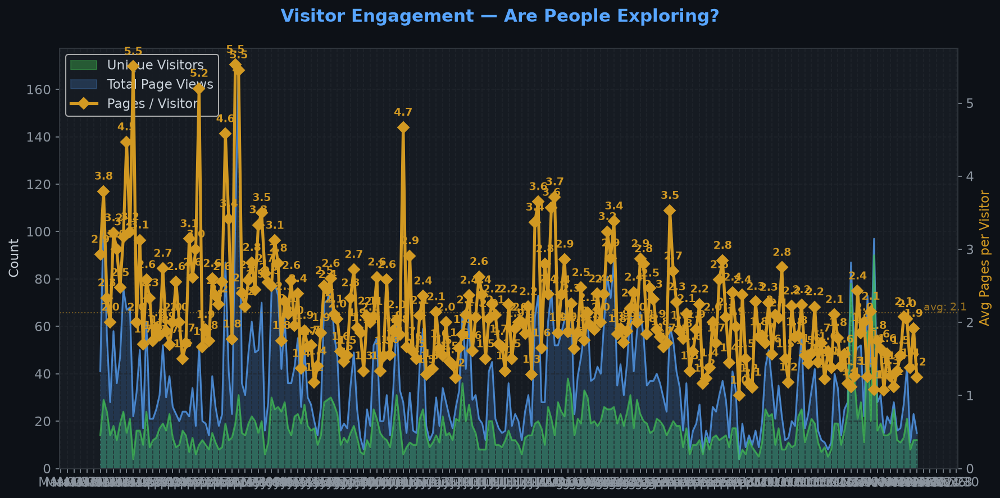
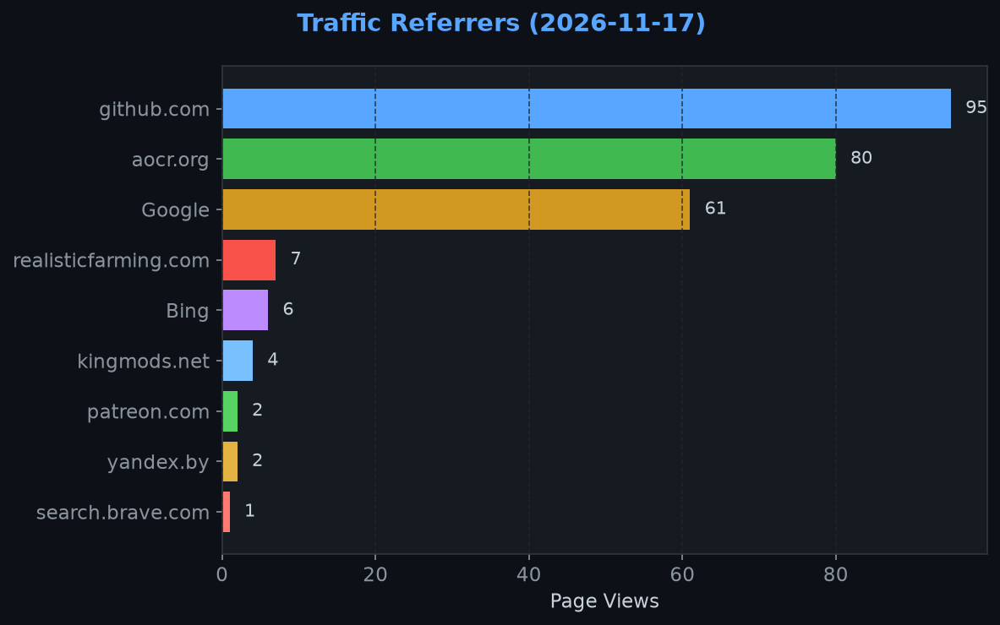

# Repository Traffic Dashboard

**Last updated:** 2026-11-25T06:29:27Z
**Days tracked:** 180 | **Download snapshots:** 1077 (hourly)

---

## Views & Clones (14-day window, preserved forever)

| Metric | 14-Day Total | Unique |
|--------|-------------|--------|
| Page Views | 290 | 141 |
| Git Clones | 384 | 113 |

> **Engagement:** 2.0 pages per visitor (14-day avg)

---

## Visitor Engagement

> Higher = visitors exploring more pages. 1.0 = bounce. 3.0+ = deeply engaged.

---

## Conversion Funnel

> **14-day conversion:** 1755 of 141 visitors cloned or downloaded (**1244.6%**)
>
> Unique cloners: 113 | Release downloads: 1642

---

## Total Acquisition per Release (Downloads + Clones)

| Channel | Count |
|---------|-------|
| Zip Downloads | 1642 |
| Git Clones (14-day) | 384 |
| **Total Acquisitions** | **2026** |

---

## Referrers

| Source | Views | Unique |
|--------|-------|--------|
| github.com | 79 | 55 |
| Google | 45 | 36 |
| realisticfarming.com | 7 | 7 |
| Bing | 4 | 3 |
| kingmods.net | 2 | 2 |
| patreon.com | 1 | 1 |
| search.brave.com | 1 | 1 |
| yandex.ru | 1 | 1 |
| youtube.com | 1 | 1 |

---

## Repository Growth

| Metric | Current |
|--------|---------|
| Stars | 30 |
| Forks | 4 |
| Watchers | 3 |

---

## Top Pages (14-day)

| Page | Views | Unique |
|------|-------|--------|
| `/Realistic-Farming/FS25_SeasonalCropStress` | 168 | 113 |
| `/Realistic-Farming/FS25_SeasonalCropStress/releases/tag/v1.2.6.1` | 41 | 32 |
| `/Realistic-Farming/FS25_SeasonalCropStress/releases` | 30 | 26 |
| `/Realistic-Farming/FS25_SeasonalCropStress/issues` | 13 | 7 |
| `/Realistic-Farming/FS25_SeasonalCropStress/issues/246` | 6 | 3 |
| `/Realistic-Farming/FS25_SeasonalCropStress/commit/faf73e2341c58c5e5dd835359ce7d25328e66227` | 4 | 4 |
| `/Realistic-Farming/FS25_SeasonalCropStress/issues/234` | 3 | 3 |
| `/Realistic-Farming/FS25_SeasonalCropStress/issues/244` | 3 | 3 |
| `/Realistic-Farming/FS25_SeasonalCropStress/issues/56` | 3 | 3 |
| `/Realistic-Farming/FS25_SeasonalCropStress/releases/tag/v1.2.6.0` | 2 | 2 |

---

## Data Files

| File | Description | Granularity |
|------|-------------|-------------|
| [daily.json](daily.json) | Views & clones per day (never expires) | Daily |
| [downloads.json](downloads.json) | Release download snapshots | Hourly |
| [referrers.json](referrers.json) | Referrer snapshots | Daily |
| [metadata.json](metadata.json) | Stars, forks, watchers | Daily |
| [stats.json](stats.json) | Combined legacy snapshots | 6-hourly |

---
*Hourly download tracking + full dashboard with engagement metrics every 6 hours*
*Auto-generated by [traffic-stats.yml](../../.github/workflows/traffic-stats.yml)*
